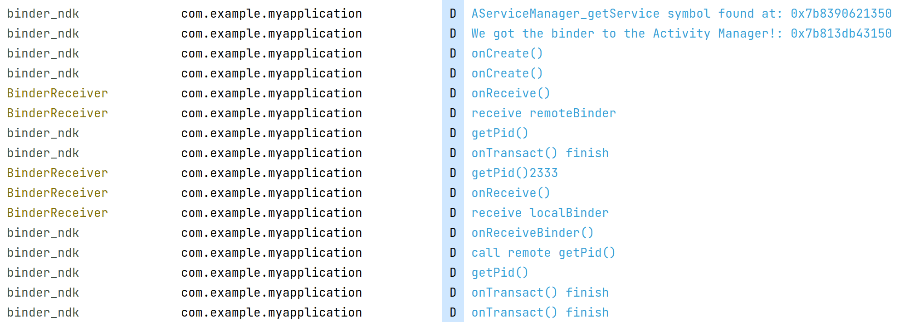

# Simple NDKBinder Demo

**Caution: `AServiceManager_getService()` isn't stable ABI**

## Introduction
This is a simple demo shows one possible way that two processes or more can do binder IPC purely using NDKBinder **without the help of JNI**.

## But how?
The key point is that how native server can publish their service & native client can get it.

After doing some research, I found two possible ways:
1. Do it like the native codes in Android Framework does.
    
    It's impossible in userspace because those APIs isn't exported to NDK & some require privilege.

2. Using BroadcastReceiver to help exchange binder

    `Parcel.writeStrongBinder` transfers Binder object into `flatten_binder`. The kernel driver finds it & creates the reference of binder for the client so that client can talk to the server directly.

    I tried implement `bindService()` first, but [it isn't an easy way to do this](https://github.com/RikkaApps/Shizuku/issues/104).

    And I found the [Shizuku](https://github.com/RikkaApps/Shizuku/blob/master/shell/src/main/java/rikka/shizuku/shell/ShizukuShellLoader.java) implement a command line tool in JAVA with the help of `BroadcastReceiver`

By the way, [NDKBinder](https://developer.android.com/ndk/reference/group/ndk-binder) from Android 10 (API 29) provide us the code we need to build Parcel & do binder transaction.

However, the NDKBinder Demo [here](https://github.com/lakinduboteju/AndroidNdkBinderExamples) only creates the Parcel in native and Java does the rest.

Luckily, [this answer](https://stackoverflow.com/questions/62202556/a-simple-way-to-build-with-the-android-ndk) on Stackoverflow shows that we can get the binder to the ActivityManager in native, the possibility to get two processes exchange their binder.

## Todo
1. Figure out how binder really works

2. Figure out the format of the parcel or make the Android Framework's `Parcel` available under NDK.
   
   The parcel used by `broadcastIntent()` works in a weired way.

   For example, it will get broken if I change Intent's `mPackage` field.

3. Support for API <= 29

   Try to implement it without the help of NDKBinder.
